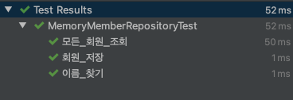
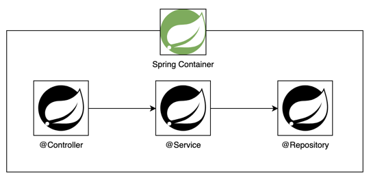

# 회원관리 예제 - 백엔드 개발

## 비즈니스 요구사항 정리

<details>
<summary>상세보기</summary>

- 데이터: 회원 ID, 이름
- 기능: 회원 등록, 조회
- 아직 데이터 저장소가 선정되지 않았다는 가상의 시나리오

</details>

### 일반적인 웹 애플리케이션 계층 구조
<details>

<summary>상세보기</summary>

- 컨트롤러: 웹 MVC의 컨트롤러 역할
- 서비스: 핵심 비즈니스 로직 구현
- 리포지토리: 데이터베이스에 접근, 도메인 객체를 DB에 저장하고 관리
- 도메인: 비즈니스 도메인 객체, 예) 회원, 주문, 쿠폰 등등 주로 데이터베이스에 저장하고 관리됨.

</details>

### 클래스 의존관계
<details>

<summary>상세보기</summary>

- 아직 데이터 저장소 선정X → 우선 인터페이스로 구현 클래스를 변경할 수 있도록 설계
- 데이터 저장소는 RDB, NoSQL 등등 다양한 저장소를 고민중인 상황으로 가정
- 개발을 진행하기 위해서 초기 개발 단계에서는 구현체로 가벼운 메모리 기반의 데이터 저장소 사용

</details>

---

### commit log

- 
  <details>
    <summary>240227. 테스트 케이스 작성</summary>

  
  
  - `MeberService` 생성 후 테스트 케이스 작성
    ```java
    class MemberServiceTest {

    MemberService memberService;
    MemoryMemberRepository memberRepository;

    @BeforeEach
    public void beforeEach() {
        memberRepository = new MemoryMemberRepository();
        memberService = new MemberService(memberRepository);
    }

    @AfterEach
    public void afterEach() {
        memberRepository.clearStore();
    }

    @Test
    void 회원가입() {
        //given
        Member member = new Member();
        member.setName("hello");

        //when
        Long saveId = memberService.join(member);


        //then
        Member findMember = memberService.findOne(saveId).get();
        assertThat(member.getName()).isEqualTo(findMember.getName());
    }

    @Test
    public void 중복_회원_예외() {
        //given
        Member member1 = new Member();
        member1.setName("spring");

        Member member2 = new Member();
        member2.setName("spring");

        //when
        memberService.join(member1);
        IllegalStateException e = assertThrows(IllegalStateException.class, () -> memberService.join(member2));
        assertThat(e.getMessage()).isEqualTo("이미 존재하는 회원입니다.");
        /*
        try {
            memberService.join(member2);
            fail();
        } catch (IllegalStateException e) {
            assertThat(e.getMessage()).isEqualTo("이미 존재하는 회원입니다.");
        }
        */


        //then
        }
    }
    ```
</details>

- <details>
  <summary>240227. 컴포넌트 스캔과 자동 의존관계 설정</summary>

  ### 스프링 빈과 의존관계
  - 회원 컨트롤러가 회원서비스와 회원 리포지토리를 사용할 수 있게 의존관계를 준비
  [MemberController.java](./src/main/java/hello/membermanageservice/controller/MemberController.java) 파일을 생성한다.
  ```java
  @Controller
  public class MemberController {
  
      private final MemberService memberService;
  
      @Autowired
      public MemberController(MemberService memberService) {
          this.memberService = memberService;
      }
  }
  ```
  - 처음에 `@Autowired` 애노테이션을 작성하기 이전에는 생성자 매개변수의 `MemberService`에 컴파일 에러가 표시가 된다.
  - 이에 대한 이유는 아래와 같다.  
    
    - `@Controller`, `@Repository`, `@Service` 등의 스프링 애노테이션은 **Spring Application**이 실행되면서 `Spring Container`에 `Spring Bean`으로서 객체로 생성되어 띄워진다.
    - `@Autowired` 애노테이션을 통해 각 의존성이 필요한 객체에 연관관계를 주입힌다.
    - 이렇게 진행하여 자동으로 의존관계를 설정하는 것을 **컴포넌트 스캔**이라 한다.
</details>